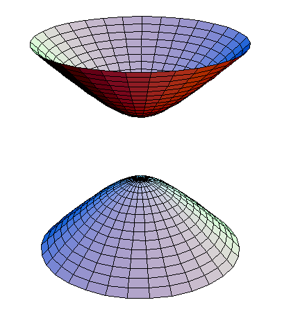

# Exploring Hyperbolic Geometry (as a Computer Scientist)

Always been a fan of the whole "if you can't explain it, you don't understand it" line of thinking, and as I've spent some time trying to wrap my head around hyperbolic geometry and its application to graph embeddings as of late, figured might as well make a git page about it. 

## Preliminaries

Most every computer scientist can remember back to the early days of their studies when they had to do that most computer scientific of things: drawing a binary tree by hand. Now, if you're anything like me, you remember no matter how you try to draw it, if the tree gets big enough you're going to run out of room on the paper and just cause yourself general annoyance. Now, there's a very good reason for that, and it has to do with a property that we all probably also learned, in that the number of nodes at a given level $l$, where the level of the root is 0, of a balanced binary tree is $2^l$. At face value this is just another boring old equation, but when we compare it to the growth patterns of a standard circle in a 2d Euclidean space, the again familiar $\pi r^2$. Here we note something critical, while the volume of Euclidean space increases polynomially with its radius, a tree increases exponentially with its depth. 

This difference, while something most of us just store and don't think much of, actually has profoud implications: a tree of sufficient depth cannot be well represented in a standard Euclidean space, the amount of tree simply grows faster than the amount of space. For visualizations graph layouts can be envisioned to mitigate the problem, but for embeddings, where distances in the embedding space should correspond to distances in the graph, we are left with no choice but to arbitrarily increase dimensionality to the detriment of most any best practice. 

Now this again at face value might seem a big claim to make: and it is - it wasn't proved rigorously until [Bourgain's 1986 paper](https://link.springer.com/article/10.1007/BF02766125) which involves a lot of lovely math and works on a Banach space (which is a superset of Euclidean space satisfying some axioms we don't really need to worry about here). Nevertheless, the proof is out there if your functional analysis is good enough to read it: no complete k-ary tree can be embedded in a Euclidean space without distorting its edge distances. 

*Expand with cool visualizations about attempts to embed trees in Euclidean spaces*

## Enter: Hyperbolic Geometry

 DXB flight path' width="200" height="150"/>

Luckily for us, there's far more out there than Euclidean geometry, and before you go getting scared, it's not some high fancy theoretic concept, the Earth is spherical (said to have Elliptic Geometry), which itself is not Euclidean. You can go look at most any map, and without that knowledge you'd probably be deeply confused as to why flights from San Francisco to Dubai need to go over the North Pole. Asking that question gets us to an important concept: that most concepts in Euclidean space have direct generalizations in non-Euclidean spaces. 

### Geodesics
First amongst those generalizations is that of the geodesic. A very fancy sounding word that means little more than a straight line. It should be common knowledge that if you have two points in space, the shortest distance between them (assuming no obstacles) is a straight line. Well, as we saw above, the flight path on the Earth's elliptic surface is not the same as on the Euclidean map, and that's simply because the geometry works out that way - the geodesic on elliptical geometry has its own solution (called a great circle), which has its own fancy formulas that we don't need to go into here. What we can note though, is that the formula for the distance between two points (in two dimensions for ease of example) highlights the differences between the two geometries. 

$d_{Euclid}(x,y) = \sqrt{(x_1 - y_1)^2 + (x_2 - y_2)^2}$

$d_{Elliptic}(x,y) = r * arccos(sin(x_1)sin(y_1) + cos(x_1)cos(y_1)cos(x_2-y_2))$

Where $r$ is the radius of the sphere being computed on. So, despite vastly different formulas, these equations represent the exact same thing: the length of the shortest path between the two points on their respective surfaces. 

### Curvature

Now you may be wondering, gosh, why are the two so different? Well, it comes down to one aspect: curvature. There's plenty of other spaces with more complex properties, but in our limited case, curvature is all there is. Euclidean space, as we all know, is a simple plane, expanding endlessly everywhere, perfectly flat and abstract. The further we get away from some point, the distance from ourselves to that point increases at some constant pace. Elliptic geometry is different, if we start from some point, our distance from that point does not grow linearly, as on Earth if you walk in one direction endlessly you'll end back right where you started - if you go far enough the distance to where you started actually starts to decrease. The key difference is curvature, where Euclidean space is flat, or have zero curvature, elliptic spaces have a positive curvature. 

This finally brings us to what we've been building towards - hyperbolic geometry. Imagine the Earth as a perfect sphere - with some unit curvature $c$. We can then imagine the opposite of this, some surface with curvature $-c$. That is to say, if in an elliptical space the space curves down, relative to say yourself on the Earth's surface, a hyperbolic space will do much the opposite - it will curve upwards. 

## Hyperbolic Properties

So, with all that out of the way, we can roughly conceive of what hyperbolic geometry is. Now the questions become - why is it useful? And if it is, how do we represent something we can barely visualize? Both, luckily for us, are deeply well studied. 

### Hyperbolic spaces grow exponentially

So, through all the above we've noted two things: Euclidean space isn't our only option, and trees grow exponentially, faster than Euclidean space does. As we've been going on and on about hyperbolics, it would seem natural to examine the formula for the area of a circle in a hyperbolic space: 

$Area_H = \pi R^2 R (cosh(2r/R) - 1)$

Now you may be saying - well that just adds a cosine term, that's hardly useful. And if that was a standard cosine, you'd be right, but we're looking at it's hyperbolic variant which has an exceedingly interesting property, it's just a decomposition of the standard exponential: $e^x = sinh(x) + cosh(x)$ - both the hyperbolic sine and cosines are exponential curves. Given that, it becomes clear that the area of the hyperbolic space grows exponentially with its radius, just as the trees we're looking at do. 

### The Poincaré Disk Model

Now that we see we can fit the tree into a hyperbolic space, we need to question how to represent them. Representing a Euclidean space is easy enough - we percieve our world as one. An elliptic space is likewise easy, because we see plenty of spheres in our world too. Hyperbolic space is different however, it grows faster than Euclidean space, and in the same sense, the hyperbolic plane is larger than the Euclidean, even though both are infinite. 

One of the earliest (and easiest to visualize) attempts at visualizing this was done by Henri Poincaré in the late 19th century. The actual maths behind the representation is again complex and past the scope of what we can cover here, but a key visualization (right, credit Wikidata) lets us understand the exponential growth. Critically - each colored region in the disk has the same hyperbolic area - with the center of the disk having the least density and density increasing exponentially towards the edges, with density rather loosly defined as the amount of space in a given area. 

### The Hyperboloid Model

The disk model is excellent for visualizations, but the maths behind it are numerically unstable. Another model of hyperbolic geometry, the Hyperboloid model proposed by Minkowski, instead of representing the plane on a disk represents it on the upper sheet of a $n+1$ dimensional hyperboloid (pictured right, credit Wikidata), where $n$ is the dimensions of the input data (ie a 2 dimesional Euclidean sytem would correspond to a 3 dimensional hyperboloid). The $n+1$ dimensions of the hyperboloid should rightfully raise some eyebrows and shows the relation between the model and what Minkowksi is arguably most famous for - his formulation of Minkowski spacetime, indeed in a physics context this extra dimension was originally formulated to represent time. Indeed, the correspondence between the two is direct, in that the formula for a hyperbola is $x^2 + y^2 - z^2 = 1$, directly relating its structure to the formula for the spacetime interval of general relativity which follows the same pattern: the euclidean distance minus the temporal distance scaled by the speed of light. 

### Relating the two

As both the hyperboloid and the disk models represent the same thing, it seems clear there should be some mapping between the two - and indeed it's even simpler than you would expect. The disk model is merely the projection of the hyperboloid onto a $n-1$ dimensional disk centered at it's origin, something again hard to visualize without a graphic (right, credit Wikidata).

This has excellent properties for visualition - any model trained on the hyperboloid can easily be mapped to a disk for ease of visualization, something we will make extensive use of later on. 

# Hyperbolic Neural Networks

Now all this is well and good, we've described the movitation for using hyperbolic spaces as well as what they are in the first place. What we've largely neglected is just how annoying they are in general - we don't usually get nice convenient easy to remember formulas, and visualization and intuition is largely a pain. To actually embed these trees however we need to learn some mapping, from the vertices of the tree to points in hyperbolic space. Rik Sarkar has an [excellent paper](https://homepages.inf.ed.ac.uk/rsarkar/papers/HyperbolicDelaunayFull.pdf) on a simple algorithm to do this for an arbitrary (complete) tree, but the method is restricted to abstract structures - ie if we have a nearly complete binary tree but one node has an extra child, the process breaks down. It also considers purely minimizing distortion of the tree - which again in an abstract case is useful but in the real world there's often other characteristics to consider. Additionally there are many use cases where a given graph may exhibit some properties of a tree but not be perfectly so - an aspect well studied and typically measured by [Gromov's delta-hyperbolicity](https://www.ihes.fr/~gromov/wp-content/uploads/2018/08/657.pdf) which seeks to define to what extent a given space (or graph) is hyperbolic by measuring, for any four points $x, y, z, w$ in that space: 

$(x, z)_w >= min((x,y)_w, (y,z)_w) - \delta$

such that: $(a,b)_c = 1/2(d(x,y) + d(x,z) - d(y,z)). $

Which also previews an alternative definition based on the triangle inequality, but again the math becomes more obsucre. 

With all that in mind, lets assume we have some tree structure and want to embed it to a hyperbolic space. While at first glance you might say great, lets just use a hyperbolic distance metric on a standard autoencoder architecture and call it a day, that runs into an issue right away: Euclidean features, coordinate systems, or what have you need to be mapped to their Hyperbolic equivalents. [Chami et al's fantastic paper](https://arxiv.org/pdf/1910.12933.pdf) covers them all in detail, but here we'll still try to describe some of the key steps. 

## Euclidean <-> Hyperbolic Maps

We can map arbitrary features from Euclidean to Hyperbolic spaces and vice versa by two mappings: the exponential map which maps from Euclidean to Hyperbolic spaces, and the logarithmic map which does the opposite. In the case of the hyperboloid model those are (in the syntax used by Chami): 

$exp_x^K(v) = cosh(\frac{||v||_L}{\sqrt{K}})x + \sqrt{K} sinh(\frac{||v||_L}{\sqrt{K}})\frac{v}{||v||_L}$

$log_x^K(y) = d_L^K(x,y)\frac{y+\frac{1}{K}|x,y|_L x}{||y + \frac{1}{K} |x,y|_Lx||_L}$

where: 

$d_L^K(x,y) = \sqrt{K} arcosh(\frac{-|x,y|_L}{K})$ is the hyperbolic distance

$|x,y|_L = -x_0y_0 + \Sigma_i^n x_iy_i$ is the Minkowski inner product (fancy term for the vector magnitude on the hyperboloid)

Now you may notice two extra parameters here we haven't defined - while $v$ is our vector to map, our exponential and logarithmic maps also require a $K$ and a $x$. $K$ is merely derived from the (as we recall always negative) curvature of our space, $c = -1/K$. $x$ is however more complicated, and has to do with the nature of the logarithmic and exponential mappings themselves. 

Consider the Earth, which as we've discussed is not Euclidean given it's spherical nature. This would come as a surprise to a child who has yet to get an education, as to our perception the world appears quite Euclidean - we do not see this curvature around us in normal environments. That gives light to a key aspect of these spaces, the idea of a tangent space. Locally about any point on an elliptical space, the region will appear Euclidean - we refer to this as the tangent space. The fact that this tangent space is Euclidean unifies the class of spaces called manifolds, of which basic Euclidean space, elliptical, and hyperbolic spaces are all part of. That should tell us enough - if we stood in a hyperbolic space we'd observe the exact same subjective Euclidean-ness all around us. 

That's all a convoluted way of motivating what $x$ actually is - $x$ is the center point at which we observe the tangent space. That is to say, for each tranformation we from the hyperbolic to Euclidean or vice versa, we must choose a point on which to center our tangent space on. If we're not bothered with it we can just as well choose the zero point of the hyperboloid, but in general we should use the center whenever possible. 

## Making Layers Hyperbolic

With all that in mind, the process of making a hyperbolic neural network becomes easier than one might think. First, we project the input data to the hyperboloid via the exponential map (with the addition of a leading zero vector, recalling that the hyperboloid is a $n+1$ dimensional space with respect to the input. Following that, (almost) all operations can be done trivially by using the logarithmic map to take the data back to a Euclidean space, and applying standard Euclidean operators on it, with hyperbolic matrix multiplication of an input $x$ and some weight matrix $W$ being defined simply as $exp_0^k(Wlog_0^K(x^H))$, where $x^H$ is the $x$ when projected onto the hyperboloid. 

### Hyperbolic Addition

This simple formulation holds true for any multiplication or activation function related layer - but we do run into issues with bias as addition and subtraction are not so trivially defined on the hyperboloid. Möbius addition is the generalized addition function in hyperbolic space, and to understand it we need to introduce yet another new concept: that of parallel transport. Conceptually, imagine two vectors on the Earth's surface of unit magnitude and facing due East, both another at the Equator, one at 0 degrees and one at 180 degrees longitude. Given they are both of equal magnitude and direction, we'd expect the sum of the two to be twice that of the originals in the same direction. However, lets try to imagine what we described, projecting both to a Euclidean space centered at the center of the Earth. In this projection, the two vectors, despite equal magnitude and diretion, will appear to be facing exactly opposite each other, cancelling each other out. This motivates the idea of paralell transport, where we move one of our vectors anchored to the surface of our manifold to the origin of the other, again we can visualize moving our vector at 180 longitude afross the equator while maintaining it's magnitude and direction until it reaches 0, where upon adding we'll recieve our expected result. This is the core of Möbius addition - for any addition or subtraction we need to ensure our vectors start at the same origin. 

## Bringing it all together

With all the preliminaries defined, all it takes is writing up the network itself. [Chami's repo](https://github.com/HazyResearch/hgcn) is a fantastic implementation of this, and in this repository you can find a modified subset of that repo designed to be as small and readable as possible in the [minimal](https://github.com/j4freeman/Hyperbolics/tree/main/minimal) section. And to demonstrate that it all does work as we described, you can embed your own tree on your machine just by running the train script. 

